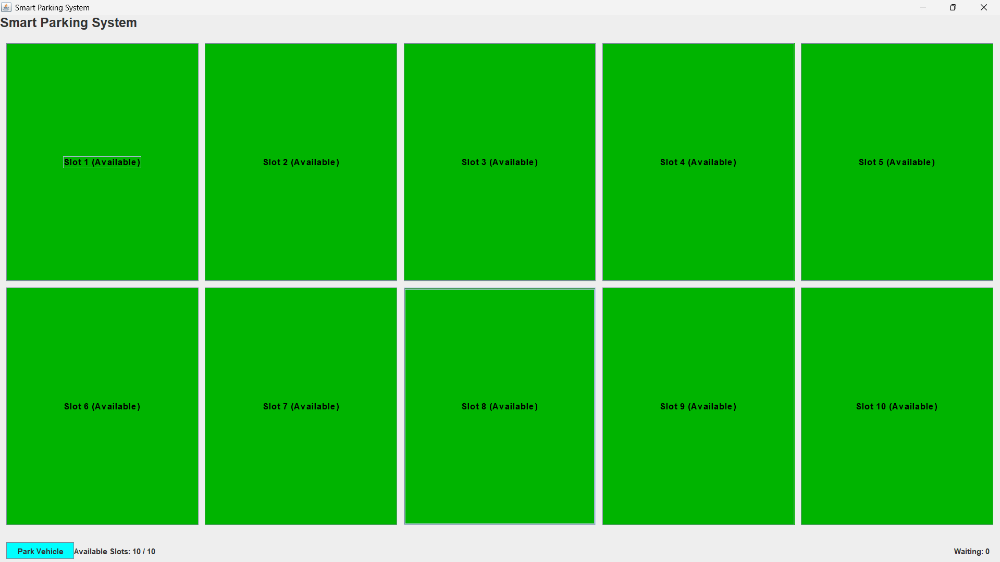

# Smart Parking System

<div align="center">


<br/>
<br/>

A modern desktop-based Smart Parking Management System built using Java Swing and Object-Oriented Programming principles.

Designed to simulate real-world parking slot allocation with an interactive GUI, waiting queue management, and dynamic vehicle handling.

</div>

---

# Features

## Interactive Parking Dashboard

* Dynamic parking slot visualization
* Real-time parking availability updates
* Color-coded parking slot indicators
* Responsive desktop GUI

## Vehicle Management

* Park vehicles instantly
* Remove parked vehicles dynamically
* Supports multiple vehicle categories
* Prevents duplicate vehicle parking

## Waiting Queue System

* Automatic waiting queue management
* FIFO queue implementation using LinkedList
* Auto allocation when slots become available

## Exception Handling

Custom exception handling for:

* Duplicate vehicle entries
* Empty slot removal attempts
* Invalid parking operations

---

# Tech Stack

| Technology         | Purpose                   |
| ------------------ | ------------------------- |
| Java               | Core Programming Language |
| Java Swing         | GUI Development           |
| AWT                | UI Components & Layouts   |
| OOP                | System Architecture       |
| Queue (LinkedList) | Waiting List Management   |

---

# System Architecture

```text
User Interaction
       ↓
Java Swing GUI
       ↓
Parking Management Logic
       ↓
Parking Slots & Queue System
```

---

# Project Structure

```bash
Smart-Parking-System/
│
├── ParkingSystemGrid.java
├── README.md
└── assets/
    └── preview.png
```

---

# Core Concepts Implemented

## Object-Oriented Programming

* Encapsulation
* Inheritance
* Abstraction
* Polymorphism

## Data Structures

* Queue using LinkedList
* Dynamic slot management

## GUI Concepts

* Event-driven programming
* Action listeners
* Layout managers
* Dynamic component updates

---

# Functional Workflow

## Parking Vehicle

1. User enters vehicle number
2. Selects vehicle type
3. System checks availability
4. Vehicle gets parked or queued

## Removing Vehicle

1. User clicks occupied slot
2. Vehicle gets removed
3. Waiting vehicle automatically enters slot
4. GUI updates dynamically

---

# Installation & Execution

## Clone Repository

```bash
git clone https://github.com/Donamol-Joseph/smart-parking-system-java.git
```

## Navigate to Project

```bash
cd smart-parking-system-java
```

## Compile

```bash
javac ParkingSystemGrid.java
```

## Run Application

```bash
java ParkingSystemGrid
```

---

# Screenshots

# Application Preview

<div align="center">



<br/>
<br/>

Interactive Java Swing Smart Parking Dashboard

</div>

---

# Future Enhancements

* Database Integration
* Parking Fee Calculation
* Admin Authentication
* Vehicle Entry Time Tracking
* Analytics Dashboard
* Dark Mode Interface
* Multi-floor Parking Simulation
* QR Based Vehicle Entry

---

# Why This Project?

This project demonstrates:

* Strong Java fundamentals
* GUI application development
* Practical implementation of data structures
* Real-world system simulation
* Clean object-oriented architecture
* Exception handling and event-driven programming

---

# Author

## Donamol Joseph

* GitHub: [https://github.com/Donamol-Joseph](https://github.com/Donamol-Joseph)
* LinkedIn: [https://www.linkedin.com/in/donamoljoseph/](https://www.linkedin.com/in/donamoljoseph/)

---

# Repository Topics

```text
java
java-swing
parking-system
gui
object-oriented-programming
smart-parking
queue-data-structure
java-project
```

---

<div align="center">

Developed
